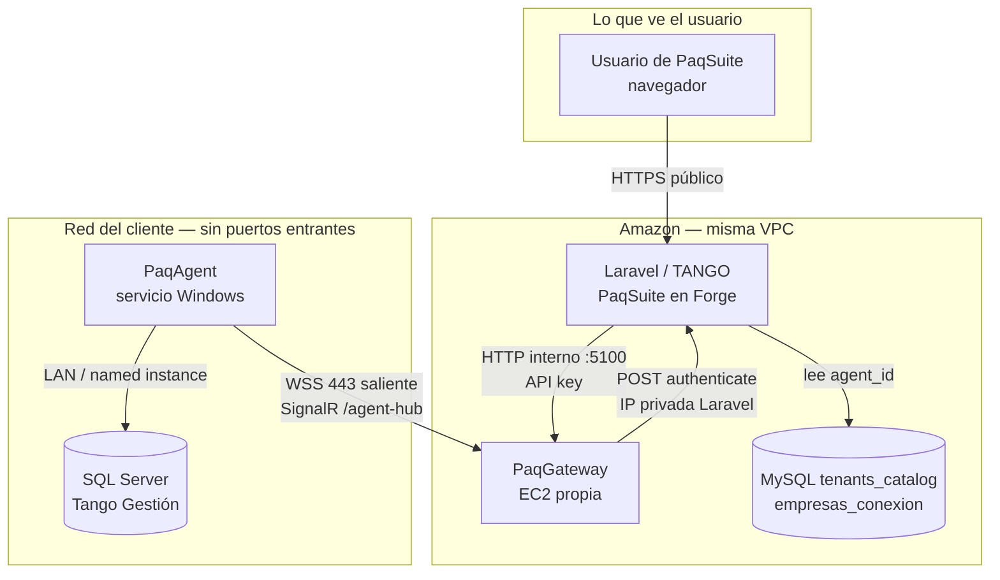
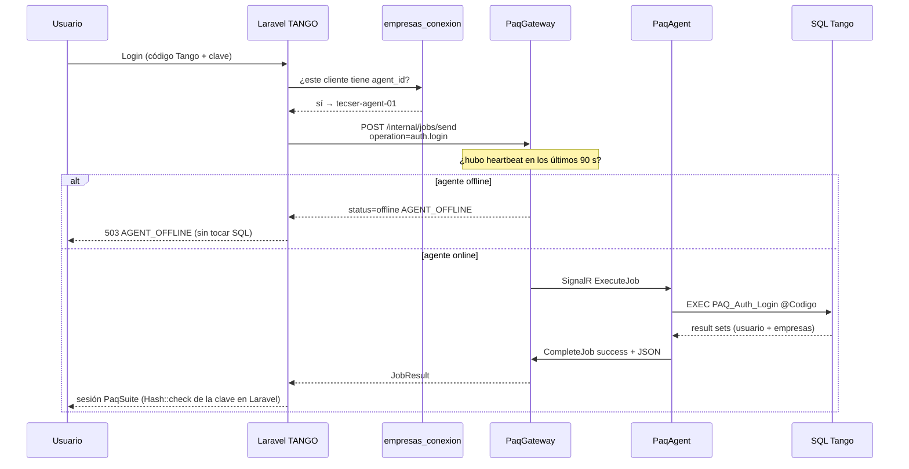
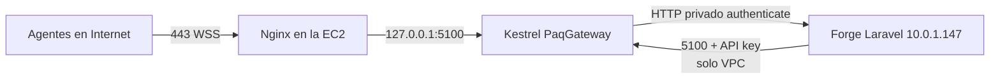
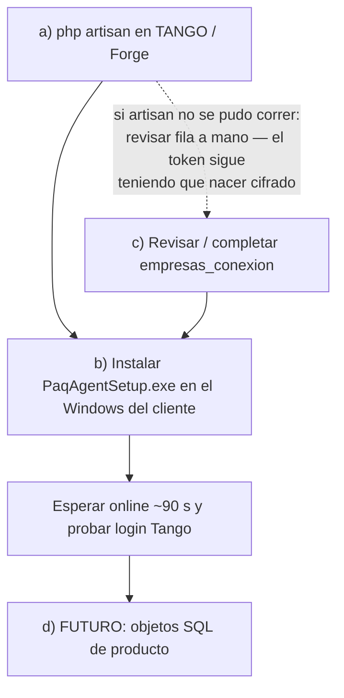
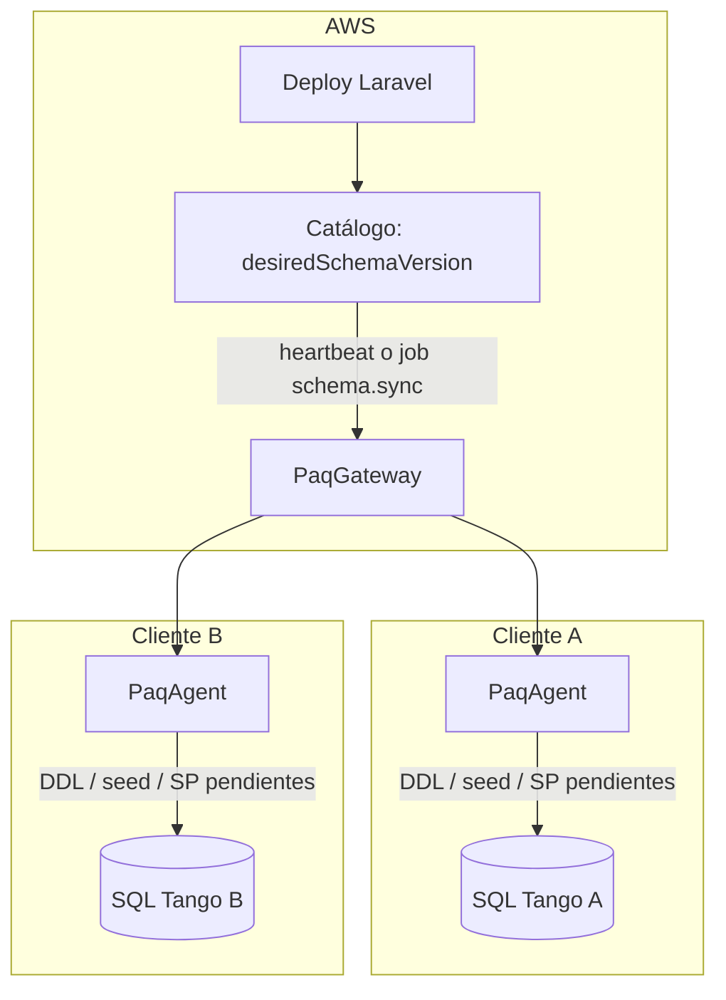

# MANUAL DEL PROGRAMADOR — PaqAgent + PaqGateway

| Campo | Valor |
|-------|--------|
| Audiencia | Programador que mantiene este repo / TANGO; soporte técnico que reconstruye el Gateway o da de alta un cliente |
| Estado | Vigente (corte 2026-09-07). Secciones 4.d, 5 y 6 = **futuro** (SPEC-AGW-002, no implementado) |
| SPEC canónico | [SPEC-AGW-001](../02-producto/SPEC-AGW-001-producto.md) (v1.3) |
| Decisiones | [decisiones-tecnicas.md](../02-producto/decisiones-tecnicas.md) |
| Fases | [fases-roadmap.md](../02-producto/fases-roadmap.md) |

Este manual **no sustituye** el SPEC. El SPEC dice *qué* hay que construir. Las decisiones dicen *qué está cerrado*. Aquí vive el *cómo funciona*, el *cómo está hecho* y el *cómo se instala*.

Si una justificación de este archivo choca con el SPEC, **manda el SPEC**. Se actualiza el SPEC primero.

---

## Índice

| § | Tema | Para quién |
|---|------|------------|
| [Vocabulario](#vocabulario-tres-nombres-que-se-parecen) | TANGO vs Tango vs Gateway | Todos |
| [1. Concepto y esquema](#1-definición-conceptual-y-esquemática) | Cómo funciona el sistema completo | Todos |
| [2. Explicación técnica](#2-explicación-técnica--cómo-está-desarrollado) | Código, contratos, repos | Programador |
| [3. Instalación del Gateway](#3-instalación-del-gateway-tarea-de-una-sola-vez) | EC2, Nginx, TLS, systemd | Soporte / ops (reconstruir AWS) |
| [4. Alta de un cliente](#4-instalación-de-un-cliente--orden-de-ejecución) | Artisan → agente → `empresas_conexion` | Operador + admin Tango |
| [4.d SQL del cliente](#4d-futuro--instalación-de-objetos-en-el-sql-del-cliente) | Objetos PQ / SP | Futuro (Fase 3) |
| [5. Actualización del agente](#5-futuro--actualización-de-un-agente) | Nueva versión del binario | Futuro (Fase 2) |
| [6. Actualización de versión SQL](#6-futuro--actualización-de-versión--objetos-sql-en-todos-los-clientes) | DDL en todos los SQL | Futuro (Fase 3) |
| [D9](#d9--distribución-del-instalador) | Por qué un exe público en TANGO | Producto / ops |
| [Prohibido](#prohibido-recordatorio-de-casa) | Tailscale, fallback, tokens | Todos |

---

## Vocabulario: tres nombres que se parecen

En el día a día se dice “Tango” para todo. Acá no es lo mismo:

| Cómo lo llamamos | Qué es en la vida real | Dónde vive |
|------------------|------------------------|------------|
| **TANGO** (mayúsculas, el repo) | La aplicación **PaqSuite** en PHP/Laravel | AWS, servidor **Forge** (`paq-2021`) |
| **Tango Gestión** | El ERP de Axoft del cliente | Windows + **SQL Server** en la red del cliente |
| **Gateway** (`PaqGateway`) | Puente SignalR entre PaqSuite y el agente | Otra EC2 en la **misma VPC** (`gateway.paqsystems.com`) |
| **Agente** (`PaqAgent`) | Servicio Windows que habla con SQL Tango y sale a Internet por 443 | El servidor del **cliente**, al lado de SQL |

El comando `empresas-conexion:alta-agente` se corre en **TANGO (Forge / AWS)**. Nunca en el SQL del cliente. Nunca en la máquina del Gateway.

Otros términos que aparecen seguido:

| Término | Significado |
|---------|-------------|
| **Tenant / `cliente`** | Identificador del cliente PaqSuite (slug; header `X-Paq-Cliente`) |
| **Modo agente** | El tenant tiene `agent_id`: Laravel **no** abre SQL hacia ese cliente |
| **Modo legacy** | El tenant **no** tiene `agent_id`: todavía puede usar SQL directo por `host`/`port` (transición) |
| **Job** | Pedido Laravel → Gateway → Agente (“ejecutá esta operación y devolveme JSON”) |
| **Heartbeat** | Pulso del agente cada 30 s; si pasan 90 s sin pulso, está **offline** |
| **`empresas_conexion`** | Tabla MySQL en AWS (catálogo `tenants_catalog`). **No** es el SQL Tango del cliente |

---

## 1. Definición conceptual y esquemática

### 1.1 El problema, en una frase

PaqSuite vive en Amazon. Tango Gestión vive en el SQL Server de cada cliente, **dentro de su red**. Abrir el puerto 1433 a Internet es inaceptable. Pedir una VPN (Tailscale u otra) por cliente no escala: IPs que cambian, fricción de soporte, y un overlay que **no es el producto**.

### 1.2 La idea: invertir el sentido de la conexión

En el diseño viejo, AWS “entraba” al SQL del cliente (IP pública, Tailscale, o agujero en el firewall).

En este diseño, **el cliente sale**. Un programita en el Windows del cliente (el **agente**) abre una conexión segura hacia Amazon (HTTPS/WebSocket, puerto **443**, el mismo que usa el navegador). Amazon **nunca** inicia una conexión SQL hacia el cliente. El SQL **nunca** se publica a Internet.

```text
Antes (legacy):     Laravel  ----1433---->  SQL del cliente     (AWS entra)
Ahora (modo agente): Laravel  ----HTTP---->  Gateway
                     Agente   ----443---->  Gateway             (el cliente sale)
                     Agente   ----LAN---->  SQL Tango
```

### 1.3 Los cuatro programas y quién habla con quién

Hay **cuatro** piezas. Ninguna es opcional en un cliente en modo agente:



Qué hace cada uno, en lenguaje de negocio:

1. **Laravel (PaqSuite)** atiende al usuario. Cuando necesita un dato de Tango (hoy: login Tango, o un diagnóstico), **no** abre SQL. Busca en `empresas_conexion` el `agent_id` de ese cliente y le pide al Gateway: “mandale este trabajo a *ese* agente”.
2. **El Gateway** es un puente. No conoce Tango ni SQL. Solo sabe: qué agentes están conectados, si el último pulso fue hace menos de 90 segundos, y cómo pasar un job de Laravel al agente correcto.
3. **El agente** vive en el Windows del cliente. Mantiene abierta la conexión al Gateway. Cuando llega un job de la lista blanca, lo ejecuta contra el SQL **local** y devuelve JSON.
4. **SQL Server Tango** no cambió de oficio: sigue siendo el ERP. Solo que ahora lo consulta el agente de al lado, no Laravel desde la nube.

El **instalador** (`PaqAgentSetup.exe`) no es un quinto runtime: es el asistente que deja el agente instalado, configurado y como servicio Windows.

### 1.4 Qué guarda AWS y qué queda en el cliente

Esta es la confusión más cara de soporte. Hay **dos bases distintas**.

| Dónde | Qué tabla / archivo | Qué guarda | Qué **no** guarda |
|-------|---------------------|------------|-------------------|
| AWS, MySQL `tenants_catalog` | `empresas_conexion` | `cliente`, `nombre`, `agent_id`, `client_id`, token **cifrado**, `activo` | Password SQL Tango, connection string al SQL del cliente |
| Windows del cliente | `C:\PaqSystems\PaqAgent\appsettings.local.json` | AgentId, ClientId, AgentToken, URL del Gateway, **usuario/clave SQL local** | Nada de AWS salvo la URL pública del hub |

Frase de negocio: “la app en AWS consulta el SQL del cliente”.

Frase técnica: Laravel usa `agent_id` → POST interno al Gateway → el Gateway usa la conexión **ya abierta por el agente** → el agente usa las credenciales SQL **locales**.

Si alguien pone una IP en `empresas_conexion.host` “para que ande” un tenant que **ya tiene** `agent_id`, está violando el diseño. En modo agente `host` **no se consulta**.

### 1.5 La vida de un pedido (ejemplo: login Tango)

El usuario escribe usuario/clave Tango en PaqSuite. Lo que ocurre detrás:



Puntos que importan para soportar esto:

- El SP **no recibe la contraseña**. Laravel verifica el hash. El agente solo trae los datos del usuario Tango.
- Si el servicio Windows está parado, PaqSuite responde **AGENT_OFFLINE**. **No** intenta el SQL por IP. Eso es el “corte duro”.
- Un tenant **sin** `agent_id` (todavía no migrado) puede seguir en SQL directo. Eso no es un “plan B” del modo agente: es el camino viejo de los que **aún no** se transformaron.

### 1.6 Online, no es “hay un cable enchufado”

El Gateway no declara online a un agente solo porque existe un socket. **Online** = último heartbeat hace menos de **90 segundos**. El agente manda un pulso cada **30 segundos**.

Si el Gateway se reinicia, los agentes se reconectan solos. Los jobs que estaban en vuelo se marcan `cancelled` (no se reenvían en silencio, para no duplicar).

La IP de salida del cliente (`last_seen_ip`) se anota por si soporte necesita ver “de qué NAT salió”. **Nunca** se usa para ruteo. Si el cliente cambia de ISP, el agente sigue siendo el mismo `agent_id`.

### 1.7 Readiness: de la red al SQL

Cuando algo “no anda”, el diagnóstico va en este orden (una falla de esquema no debe tapar una falla de red):

```text
network_ok → gateway_authenticated → sql_connection_ok → schema_ready → operational
```

| Síntoma en PaqSuite / job | Qué significa | Dónde mirar |
|---------------------------|---------------|-------------|
| El agente no aparece | No llega al hub (DNS, 443, TLS) | Firewall del cliente, URL del Gateway |
| Conecta y se cae | Token rechazado (alta en otro Laravel, `APP_KEY` distinto, token viejo) | Artisan en Forge + `appsettings.local.json` |
| `offline` / `AGENT_OFFLINE` | Sin pulso en 90 s, o servicio detenido | `Get-Service PaqAgent` |
| `degraded` | Red/auth OK; SQL o esquema no | Credenciales SQL, SP `PAQ_Auth_Login` |
| `timeout` | El job llegó; la espera se venció | SQL lento o red |
| `OPERATION_NOT_ALLOWED` | Pidieron algo fuera de la lista blanca MVP | Solo `diagnostics.run` y `auth.login` |

### 1.8 Qué entra hoy y qué queda para después

Hoy (Fase 1, MVP de **caño**): un cliente en modo agente, sin VPN, puede instalar el agente, aparecer online, correr un diagnóstico y hacer **login Tango** vía Gateway. Si el agente cae, PaqSuite dice AGENT_OFFLINE y no cae a SQL por IP.

No entra todavía (Fases 2 y 3, [SPEC-AGW-002](../02-producto/agente-gateway/SPEC-AGW-002-ciclo-sql-y-updates.md)):

- Que el agente se actualice solo cuando hay un exe nuevo.
- Instalar/actualizar masivamente tablas, seeds y stored procedures de producto en el SQL de todos los clientes.
- El resto de operaciones de negocio (`clientes.buscar`, etc.).

El piloto de negocio es **un** stored procedure (`PAQ_Auth_Login`). No es “ya migró todo el esquema PQ”.

### 1.9 Lab vs producción (no mezclarlos)

| | Lab en la PC del programador | Producción / piloto cliente |
|--|------------------------------|------------------------------|
| Gateway | `http://127.0.0.1:5100/agent-hub` | `https://gateway.paqsystems.com/agent-hub` |
| Auth del agente | Stub Dev (`UseDevAuthStub=true`) | Laravel `POST /api/internal/gateway/authenticate` |
| Token | `lab-token-manual` (solo lab) | El que imprimió Artisan en Forge |
| SQL | Diccionario de lab, LAN | SQL Tango de ese servidor |
| Config | `appsettings.local.json` a mano | Asistente `PaqAgentSetup.exe` |

El servicio Windows se llama igual (`PaqAgent`): no dejes el lab apuntando a localhost si vas a probar contra AWS.

---

## 2. Explicación técnica — cómo está desarrollado

### 2.1 Dos repos, un circuito

| Repo | Rama de trabajo | Qué hay |
|------|-----------------|--------|
| **`PaqSuite-IA-AgenteCliente-PAQ`** (este) | `sdd-reformulacion` | Gateway, Agente, Instalador, contratos .NET, docs SDD |
| **`PaqSuite-IA-TANGO`** | `FRAMEWORK` | Alta `empresas_conexion`, cliente HTTP al Gateway, `auth.login` Laravel, corte duro AGENT_OFFLINE |

Este repo **no** codea PHP. Las TR Laravel se especifican aquí (mismos IDs) y se implementan allá.

Solución .NET 8:

```text
PaqAgentGateway.sln
├── src/PaqContracts          DTOs compartidos (job, result, heartbeat)
├── src/PaqGateway            ASP.NET Core + SignalR (AWS)
├── src/PaqAgent              Worker Service → Windows Service
├── src/PaqAgentInstaller     WinForms (asistente)
├── tests/PaqAgent.Tests
├── tests/PaqGateway.Tests
└── tools/LabAgentMock        Agente falso para probar el hub
```

```bash
dotnet build PaqAgentGateway.sln
dotnet test PaqAgentGateway.sln
```

Convención: **camelCase** en variables, propiedades, métodos y JSON. Tipos públicos C# en PascalCase (`class AgentHub`).

### 2.2 Contrato compartido (`PaqContracts`)

Archivo canónico: `src/PaqContracts/Contracts.cs`.

| Pieza | Valores / rol |
|-------|----------------|
| Operaciones MVP | `diagnostics.run`, `auth.login` |
| Estados de job | `success` \| `failed` \| `timeout` \| `offline` \| `degraded` \| `cancelled` |
| Presencia | `online` \| `offline` \| `degraded` |
| Hub SignalR | `ExecuteJob` (Gateway→Agente), `CompleteJob` y `Heartbeat` (Agente→Gateway) |
| TTL | heartbeat 30 s, online 90 s (`AgentDefaults`) |
| Ganchos fase 2 | `AgentHeartbeat.agentVersion`, `schemaVersionApplied` (se informan; **no** disparan update todavía) |

Un job que manda Laravel (el Gateway asigna `jobId`):

```json
{
  "traceId": "01J8…",
  "agentId": "tecser-agent-01",
  "clientId": "tecser",
  "operation": "auth.login",
  "parameters": { "codigo": "PQ", "_database": "TEC_METAL" },
  "timeoutSeconds": 30
}
```

`traceId` correlaciona logs en Laravel, Gateway y archivo del agente. Sin secretos en esos logs (token, password, connection string).

### 2.3 PaqGateway — el puente

Entrada: `src/PaqGateway/Program.cs`.

**Dos caras de red:**

| Cara | Path | Quién llama | Cómo se protege |
|------|------|-------------|-----------------|
| Pública (agentes) | `/agent-hub` | PaqAgent por WSS 443 | Token en query al conectar; Nginx **no** publica `/internal` |
| Interna (Laravel) | `POST /internal/jobs/send` · `GET /internal/agents/{agentId}/status` | Laravel por IP privada `:5100` | Header `X-Paq-Internal-Api-Key` (`InternalApiKeyMiddleware`) |

Flujo al conectar un agente (`AgentHub.OnConnectedAsync`):

1. Lee `agentId`, `clientId`, `agentToken` de la query del negotiate SignalR.
2. Autentica (`IAgentAuthenticator`):
   - **Development** + `UseDevAuthStub=true`: stub (solo lab). Si alguien pone el stub en Production, el proceso **no arranca**.
   - **Production**: `POST` a Laravel `api/internal/gateway/authenticate` (URL **privada** de Forge). Cache ~60 s (`Gateway__AgentTokenCacheSeconds`).
3. Si no es `Authorized`, aborta la conexión (el agente no queda online).
4. Si sí: registra en memoria `agentId → connectionId + lastSeenAt + lastSeenIp`.

**No hay Redis ni varias instancias** en el MVP. El registro es un `ConcurrentDictionary` en proceso (`AgentRegistry`). Reiniciar el Gateway vacía esa memoria; los agentes vuelven a conectar.

Despacho de un job (`JobDispatchService`):

1. Exige `traceId` + `agentId`.
2. Resuelve presencia por TTL. Si offline → `AGENT_OFFLINE` **sin** llamar al agente.
3. Genera `jobId`, registra un `Task` pendiente, invoca `ExecuteJob` en esa conexión SignalR.
4. Espera hasta `timeoutSeconds` (default 30). El agente responde con `CompleteJob`.
5. Si vence: `timeout` / `AGENT_TIMEOUT`. Si el proceso se apaga: `JobShutdownService` marca pendientes como `cancelled`.

Laravel **nunca** debe pegarle a `https://gateway.paqsystems.com/internal/...`. Eso da 404 de Nginx a propósito. Jobs y status van a `http://<IP-privada>:5100`.

### 2.4 PaqAgent — el servicio en el cliente

Entrada: `src/PaqAgent/Program.cs`. Host genérico + `AddWindowsService` (nombre `PaqAgent`) + Serilog a `logs/paqagent-*.log`.

Config: `appsettings.local.json` junto al exe (**no** se pisa en un update futuro; **no** se commitea con secretos).

`AgentGatewayConnector` (hosted service):

1. Si faltan identidad o URL, no conecta.
2. Rechaza el token literal `dev-agent-token`.
3. Arma la URL del hub con query `agentId` / `clientId` / `agentToken` (en logs la URL va **sin** token).
4. `HubConnection` con reconexión automática (5 s → 60 s).
5. Cada 30 s: `Heartbeat` (versión del assembly + readiness).
6. Al recibir `ExecuteJob`:
   - `diagnostics.run` → `DiagnosticsRunner` (ping SQL, arma readiness).
   - `auth.login` → `AuthLoginRunner` → SP `PAQ_Auth_Login` (multi result set).
   - cualquier otra operación → `failed` / `OPERATION_NOT_ALLOWED`.
7. Devuelve `CompleteJob`.

SQL: `Microsoft.Data.SqlClient`. El connection string se arma en el agente (`SqlConnectionStringFactory`). Instancia con nombre (`SERVIDOR\AXSQLEXPRESS`) no necesita puerto. `encrypt` / `trustServerCertificate` deben alinearse a SSMS: si SSMS usa cifrado **Opcional** y el agente pone `encrypt: true`, suele aparecer `SQL_UNREACHABLE`.

Scripts del SP piloto (lab / primera vez en un SQL): `src/PaqAgent/Sql/` — ver [Sql/README.md](../../src/PaqAgent/Sql/README.md). Eso **no** es el bootstrap masivo de producto (Fase 3).

### 2.5 Instalador (`PaqAgentInstaller`)

WinForms, asistente de 5 pasos (`WizardForm`):

0. Detectar .NET 8 **Desktop** Runtime x64 (aviso + ACK; SHOULD ofrecer descarga Microsoft).
1. Credenciales: AgentId, ClientId, AgentToken (password-char, **sin default**), Gateway URL (default de fábrica `https://gateway.paqsystems.com/agent-hub`), SQL local, directorio (`C:\PaqSystems\PaqAgent`).
2. **Probar SQL** (si falla, no instala). **Probar Gateway** (DNS/TLS/443; si falla, aborta salvo checkbox avanzado “instalar de todos modos”).
3. Copiar binarios (payload zip embebido, o carpeta `agent/` en lab), escribir `appsettings.local.json`, registrar servicio `PaqAgent` `start=auto`.
4. Resultado: servicio Running + “esperando online en PaqSuite”.

Empaquetado de cara al cliente: un solo `PaqAgentSetup.exe` (D9). Build: `.\scripts\pack-installer.ps1` → `artifacts/PaqAgentSetup.exe` + `.sha256`. Detalle: [empaquetado-instalador.md](../06-operacion/empaquetado-instalador.md).

“Probar Gateway” **no** autentica el token. Solo mira si hay salida 443/TLS. El login del token ocurre cuando arranca el servicio.

### 2.6 Contrato Laravel (TANGO) — lo que este repo espera

| Pieza | Dónde (TANGO) | Rol |
|-------|----------------|-----|
| Alta modo agente | `empresas-conexion:alta-agente` | Genera ids + token; INSERT/UPDATE en `empresas_conexion` |
| Token en BD | columna `agent_token` cifrada con `APP_KEY` (`Crypt::encryptString`) | Fuente de verdad |
| Auth del Gateway | `POST /api/internal/gateway/authenticate` | El Gateway pregunta si el trío agentId/clientId/token es válido |
| Cliente HTTP | `AgentGatewayClient` | `AGENT_GATEWAY_URL` = IP privada `:5100` + `AGENT_GATEWAY_INTERNAL_KEY` |
| Ruteo | si hay `agent_id` → solo Gateway | `host` no se usa |
| Offline | login HTTP **503** + señal `AGENT_OFFLINE` | Sin fallback SQL |
| Tenancy | `ResolveTenant` modo agente **no** abre PDO por `host` | Nota 2026-09-05 |

El body exacto de `authenticate` sigue como hueco de SPEC (Q-G1). En código del Gateway se manda JSON camelCase `{ agentId, clientId, agentToken }` y se interpreta: **200** = Authorized, **403** = Inactive, otro = Invalid.

### 2.7 Circuito SDD (cómo se trabaja en este repo)

```text
A SPEC → A1 ambigüedad → B HU → B1 enriquecer
  → C TR → C1 ambigüedad → D1 plan → D código → E tests → F1 evidencia → F docs↔código
```

Comando: `Hacé el paso X`. Dispatcher: `.cursor/rules/00-dispatcher-agente-gateway.mdc`.

Épica MVP: `001-Conectividad`. Orden D: HU-001 → 002 → 004 → 005 → 006 → 007 → 003 → 008.

Estados HU/TR: `Pendiente` → `Especificado` → `Pendiente de Revisión` (tras D) → `Finalizado` (**solo humano**).

Lab por tramos (sin AWS ni instalador): [lab-local.md](../06-operacion/lab-local.md).

### 2.8 Mapa de secretos (D3)

| Secreto | Dónde | Quién lo carga |
|---------|--------|----------------|
| Usuario/password SQL Tango | Solo el PC del cliente (`appsettings.local.json`) | Instalador |
| AgentToken (claro) | Cliente: JSON local. AWS: **cifrado** en `empresas_conexion` | Artisan + instalador |
| API key Laravel ↔ Gateway | `/etc/paqgateway/env` y `.env` de Forge | Operador PaqSystems |
| Connection string SQL en Laravel | **No existe** en modo agente | — |

Copia ops de keys del Gateway (fuera de git): `C:\Programacion\KEYS\paq-gateway-ia\keys-solicitados-instalacion.txt`.

---

## 3. Instalación del Gateway (tarea de una sola vez)

Esta sección es para **soporte técnico** que deba **reconstruir** el puente en AWS. Se hace **una vez** por ambiente (hoy: producción). No se repite por cada cliente.

Runbook corto: [deploy-gateway-aws.md](../06-operacion/deploy-gateway-aws.md).  
Bitácora de la instalación real *2026-09-05*: [instalacion-exhaustiva-paq-gateway-ia.md](../06-operacion/deploy/instalacion-exhaustiva-paq-gateway-ia.md).

**Convención:** los valores *entre asteriscos* son de la instancia de referencia. Al crear una **nueva** EC2, copiá el procedimiento y **reemplazá** IPs, IDs y keys. No reutilices la EC2 de Forge ni la notebook de un programador.

**Prohibido:** Tailscale como camino de producción; abrir SQL *1433* a Internet; publicar `/internal/*` en Nginx público; `UseDevAuthStub=true` o keys `change-me-in-production`.

### 3.1 Qué tiene que quedar andando



- Hostname público: **gateway.paqsystems.com** (zona Route 53 `paqsystems.com`; el dominio histórico `paqsuite.com` **no existe** en la cuenta).
- Hub: `https://gateway.paqsystems.com/agent-hub`.
- Laravel → Gateway: `http://<IP-privada>:5100` (no el hostname público).

### 3.2 Ficha de la instancia de referencia (*2026-09-05*)

```text
Cuenta AWS / región: 655232113361 / us-east-2 (Ohio)
VPC: vpc-0588b88f9c6772017 (paq-2021) — misma que Forge
Subnet: subnet-0b2e94121d57cadd1
EC2: i-026ab0a7c3a957fd2  Name=Paq-Gateway-IA
AMI: Amazon Linux 2023   Tipo: t3.micro   User SSH: ec2-user
IP privada: 10.0.1.224
IP pública: 3.142.236.237 (auto-asignada; EIP fija pendiente opcional)
SG: sg-038e5fa123db1b5c8 (paq-gateway-ia)
Forge: i-0ab40b2f17c7894c9 / 10.0.1.147 / sg-012112202a70d9d29
DNS: gateway.paqsystems.com → 3.142.236.237
TLS: Let's Encrypt /etc/letsencrypt/live/gateway.paqsystems.com/
Kestrel: ASPNETCORE_URLS=http://0.0.0.0:5100
PEM: %USERPROFILE%\.ssh\pq-ia-gateway.pem
Keys (fuera de git): C:\Programacion\KEYS\paq-gateway-ia\keys-solicitados-instalacion.txt
```

### 3.3 Paso a paso — crear la EC2

1. Consola AWS → región **us-east-2** → EC2 → *Launch instance*.
2. Name: `Paq-Gateway-IA` (u otro nombre si es otro ambiente).
3. AMI: **Amazon Linux 2023**.
4. Tipo: **t3.micro** (MVP).
5. Key pair: una dedicada al Gateway. Guardar el PEM en `%USERPROFILE%\.ssh\` con ACL restringida al usuario Windows. **No** commitear el PEM.
6. Red:
   - VPC: la **misma** que Forge (`vpc-0588b88f9c6772017` en la referencia).
   - Subnet: la pública que usa Forge.
   - Auto-assign public IP: **sí** (o asociar Elastic IP en el paso 3.4).
7. Security group **nuevo** (nombre tipo `paq-gateway-ia`):

   | Tipo | Puerto | Origen | Motivo |
   |------|--------|--------|--------|
   | HTTPS | 443 | `0.0.0.0/0` | Agentes WSS |
   | HTTP | 80 | `0.0.0.0/0` | Let's Encrypt + redirect |
   | Custom TCP | 5100 | **SG de Forge** (no Internet) | `/internal/*` |
   | SSH | 22 | IP oficina `/32` | Admin |
   | SQL 1433 | — | — | **Prohibido** a Internet |

   Outbound: default allow (el Gateway debe alcanzar la IP privada de Laravel para authenticate).

8. Disco: default gp3 alcanza.
9. Launch → anotar **instance id**, IP **privada** e IP **pública**.

SSH desde Windows:

```powershell
ssh -i "$env:USERPROFILE\.ssh\pq-ia-gateway.pem" ec2-user@<IP-PUBLICA>
```

Prompt esperado: `[ec2-user@ip-10-x-x-x ~]$`. Si el PEM es rechazado, la ACL del archivo está demasiado abierta: restringirla al usuario.

### 3.4 Elastic IP (recomendado antes de fijar DNS)

La IP pública auto-asignada **cambia** si se hace stop/start de la instancia.

1. VPC → Elastic IPs → Allocate (misma región).
2. Associate a la EC2 del Gateway.
3. El registro A de `gateway.paqsystems.com` apunta a **esa EIP**.
4. No hace falta reemitir el certificado si el hostname no cambió.

### 3.5 Software base en la EC2

```bash
sudo dnf update -y
sudo dnf install -y nginx
# Instalar Microsoft ASP.NET Core 8 Runtime (Linux x64), no el SDK.
dotnet --list-runtimes   # debe listar Microsoft.AspNetCore.App 8.x

sudo useradd --system --home /opt/paqgateway --shell /usr/sbin/nologin paqgateway || true
sudo mkdir -p /opt/paqgateway /etc/paqgateway
sudo chown -R paqgateway:paqgateway /opt/paqgateway
```

### 3.6 Publicar el binario y copiarlo

En la máquina de build (Windows), raíz de este repo:

```powershell
dotnet publish src/PaqGateway -c Release -o artifacts/paqgateway
```

Debe existir `artifacts/paqgateway/PaqGateway.dll`. `artifacts/` está en `.gitignore`.

```powershell
scp -i "$env:USERPROFILE\.ssh\pq-ia-gateway.pem" -r artifacts/paqgateway/* ec2-user@<IP-PUBLICA>:/tmp/paqgateway-new/
```

En la EC2:

```bash
sudo mkdir -p /tmp/paqgateway-new
sudo rsync -a --delete /tmp/paqgateway-new/ /opt/paqgateway/
sudo chown -R paqgateway:paqgateway /opt/paqgateway
ls -la /opt/paqgateway/PaqGateway.dll
```

### 3.7 Archivo de entorno `/etc/paqgateway/env`

Valores secretos: **solo** desde el archivo de keys local. Preferir `tee` (no nano) para no corromper el archivo.

```bash
sudo tee /etc/paqgateway/env > /dev/null <<'EOF'
ASPNETCORE_ENVIRONMENT=Production
ASPNETCORE_URLS=http://0.0.0.0:5100
Gateway__InternalApiKey=<PEGAR_DESDE_KEYS_LOCAL>
LaravelApi__BaseUrl=http://10.0.1.147
LaravelApi__InternalApiKey=<PEGAR_DESDE_KEYS_LOCAL>
Gateway__UseDevAuthStub=false
EOF

sudo chown root:paqgateway /etc/paqgateway/env
sudo chmod 640 /etc/paqgateway/env
sudo cat -A /etc/paqgateway/env
```

`LaravelApi__BaseUrl` es la IP **privada** de Forge, **sin** Tailscale y **sin** el hostname público del Gateway.

**Lección crítica:** si Kestrel escucha solo en `127.0.0.1:5100`, Nginx local funciona y Forge **no**. Tiene que ser `0.0.0.0:5100`. La exposición a Internet la corta el **Security Group** (solo el SG de Forge → 5100), no el bind a loopback.

```bash
ss -lntp | grep 5100
# Esperado: LISTEN ... 0.0.0.0:5100
```

### 3.8 systemd

Plantilla del repo: [paqgateway.service](../06-operacion/deploy/paqgateway.service).

```bash
sudo tee /etc/systemd/system/paqgateway.service > /dev/null <<'EOF'
[Unit]
Description=PaqGateway (SignalR agent hub)
After=network-online.target
Wants=network-online.target

[Service]
Type=simple
User=paqgateway
Group=paqgateway
WorkingDirectory=/opt/paqgateway
ExecStart=/usr/bin/dotnet /opt/paqgateway/PaqGateway.dll
Restart=always
RestartSec=5
KillSignal=SIGINT
TimeoutStopSec=30
EnvironmentFile=-/etc/paqgateway/env
Environment=ASPNETCORE_ENVIRONMENT=Production
Environment=DOTNET_PRINT_TELEMETRY_MESSAGE=false
SyslogIdentifier=paqgateway
NoNewPrivileges=true
PrivateTmp=true

[Install]
WantedBy=multi-user.target
EOF

sudo systemctl daemon-reload
sudo systemctl enable --now paqgateway
sudo systemctl status paqgateway --no-pager
```

Smoke local (el path `/internal/status` **no existe**):

```bash
curl -sS -i -H "X-Paq-Internal-Api-Key: <Gateway__InternalApiKey>" \
  http://127.0.0.1:5100/internal/agents/lab-agent-01/status
```

Esperado: HTTP 200 y JSON con `"status":"offline"` si no hay agente.

### 3.9 Nginx: primero HTTP, después TLS

En Amazon Linux el vhost va en `/etc/nginx/conf.d/gateway.conf`. **No** activar `listen 443 ssl` hasta tener certificado: `nginx -t` falla.

```bash
sudo tee /etc/nginx/conf.d/gateway.conf > /dev/null <<'EOF'
upstream paqgateway_kestrel {
    server 127.0.0.1:5100;
    keepalive 32;
}

server {
    listen 80;
    listen [::]:80;
    server_name gateway.paqsystems.com;

    location /agent-hub {
        proxy_pass http://paqgateway_kestrel;
        proxy_http_version 1.1;
        proxy_set_header Upgrade $http_upgrade;
        proxy_set_header Connection "upgrade";
        proxy_set_header Host $host;
        proxy_set_header X-Forwarded-For $proxy_add_x_forwarded_for;
        proxy_set_header X-Forwarded-Proto $scheme;
        proxy_read_timeout 3600s;
        proxy_send_timeout 3600s;
    }

    location /internal {
        return 404;
    }

    location / {
        return 404;
    }
}
EOF

sudo nginx -t && sudo systemctl enable --now nginx && sudo systemctl reload nginx
```

Probar **con** header Host (si no, gana el server default de AL2023 y todo es 404):

```bash
curl -sS -o /dev/null -w '%{http_code}\n' -H 'Host: gateway.paqsystems.com' http://127.0.0.1/agent-hub
curl -sS -o /dev/null -w '%{http_code}\n' -H 'Host: gateway.paqsystems.com' http://127.0.0.1/internal/x
```

Esperado: hub ≈ 400 (SignalR ante GET simple); `/internal` = 404.

### 3.10 DNS Route 53

Zona: **paqsystems.com** (no `paqsystems.ar`, no `paqsuite.com`).

| Campo | Valor |
|--------|--------|
| Nombre | `gateway` → FQDN `gateway.paqsystems.com` |
| Tipo | A |
| Valor | EIP o IP pública de la EC2 |
| TTL | 300 |

```bash
getent hosts gateway.paqsystems.com
```

### 3.11 Certificado Let's Encrypt

Prerrequisitos: DNS ya resuelve; SG abre 80 y 443; Nginx con el vhost del hostname.

```bash
sudo dnf install -y certbot python3-certbot-nginx
sudo certbot --nginx -d gateway.paqsystems.com \
  --non-interactive --agree-tos \
  --register-unsafely-without-email --redirect
```

Deja el cert en `/etc/letsencrypt/live/gateway.paqsystems.com/` y reescribe el vhost a HTTPS. Dejar el timer de renovación habilitado.

Verificación pública:

```bash
curl -sS -o /dev/null -w 'hub:%{http_code}\n' https://gateway.paqsystems.com/agent-hub
curl -sS -o /dev/null -w 'internal:%{http_code}\n' https://gateway.paqsystems.com/internal/jobs/send
```

Esperado: `hub:400`, `internal:404`.

### 3.12 Cablear Laravel (en Forge, no en esta EC2)

| Ítem | Valor |
|------|--------|
| URL Gateway (jobs/status) | `http://<IP-privada-EC2>:5100` |
| Header | `X-Paq-Internal-Api-Key` = mismo valor que `Gateway__InternalApiKey` |
| Auth agentes | endpoint Laravel que consume `LaravelApi__*` |
| **No** usar | `https://gateway.paqsystems.com` para `/internal/*` |

Desde Forge:

```bash
curl -sS -i -H "X-Paq-Internal-Api-Key: <misma-key>" \
  http://<IP-privada-GW>:5100/internal/agents/lab-agent-01/status
```

Esperado: 200.

### 3.13 Checklist de aceptación

| # | Prueba | OK |
|---|--------|----|
| 1 | `systemctl status paqgateway` → active | |
| 2 | `ss` → `0.0.0.0:5100` | |
| 3 | Local `GET /internal/agents/.../status` + API key → 200 | |
| 4 | HTTPS hub público → ~400 | |
| 5 | HTTPS `/internal` → 404 Nginx | |
| 6 | Desde Forge → `http://<IP-privada>:5100/...` → 200 | |
| 7 | `UseDevAuthStub=false` | |
| 8 | SG sin 1433 público | |
| 9 | Un agente real o lab con token de Artisan queda **online** | |

Tras esto, cada cliente nuevo **no** toca esta EC2. Sigue la [sección 4](#4-instalación-de-un-cliente--orden-de-ejecución).

### 3.14 Recrear desde cero (lista corta)

1. Nueva EC2 en misma VPC/subnet/región; anotar IDs/IPs.
2. SG con las reglas de §3.3 (origen 5100 = SG Laravel vigente).
3. Preferir **EIP** antes de DNS.
4. Runtime .NET 8 + Nginx + usuario `paqgateway`.
5. `dotnet publish` → scp → `/opt/paqgateway`.
6. `/etc/paqgateway/env` con `0.0.0.0:5100` y keys **nuevas o rotadas**.
7. systemd enable --now.
8. Nginx HTTP → DNS A → certbot → HTTPS.
9. Smoke local + Forge + público.
10. Actualizar esta ficha, [urls-deploy.md](../06-operacion/urls-deploy.md) y keys fuera de git.
11. En TANGO, actualizar `AGENT_GATEWAY_URL` a la **nueva** IP privada.

### 3.15 Contingencias frecuentes

| Síntoma | Causa | Acción |
|---------|--------|--------|
| Forge no conecta a `:5100` | Bind `127.0.0.1` o SG mal | `ASPNETCORE_URLS=http://0.0.0.0:5100`; origen = SG Forge |
| curl a la IP da 404 en el hub | Server default / sin `Host` | `-H 'Host: gateway.paqsystems.com'` |
| Certbot timeout | SG sin 80 o DNS mal | Abrir 80; corregir A |
| Unit no arranca | chmod/owner del env | `root:paqgateway` `640` |
| `grep` del env corta un `&&` | sin sudo | `sudo cat` / `sudo grep` |
| DNS `paqsuite.com` no aparece | Dominio inexistente | Usar `gateway.paqsystems.com` |
| IP pública cambió | Sin EIP | Asociar EIP; actualizar A |
| 404 en `/internal/status` | Ruta inexistente | `/internal/agents/{id}/status` |
| Hub up pero agente no autentica | Laravel authenticate / keys / `APP_KEY` | Cablear TANGO; el token tiene que haberse generado **en ese** Laravel |

---

## 4. Instalación de un cliente — orden de ejecución

El Gateway (§3) ya está en el aire. Ahora se da de alta **un** tenant. El orden **no se puede dar vuelta**:



1. Si invertís **a** y **b**, el agente no tiene identidad válida en AWS (el Gateway pregunta a Laravel y Laravel no conoce el token).
2. Si invertís el deploy de la rama `FRAMEWORK` y el artisan, Forge **no tiene** el comando.
3. El paso **c** no reemplaza **a**: un INSERT a mano con el token en texto plano **no sirve** (Laravel lo guarda cifrado con `APP_KEY`).
4. El paso **d** no forma parte del MVP de caño. Hoy, como máximo, se aplican los scripts del SP piloto `PAQ_Auth_Login` si ese SQL todavía no los tiene.

Instructivo corto para el admin del servidor: [instalacion-agente.md](../06-operacion/instalacion-agente.md).

### 4.a) `php artisan` en Laravel (MUST)

**Dónde:** sitio PaqSuite / TANGO en Forge (`paq-2021`, IP privada `10.0.1.147`). **No** la EC2 del Gateway. **No** el Windows del cliente.

**Código:** repo `PaqSuite-IA-TANGO`, rama **`FRAMEWORK`**. Hasta que Forge despliegue esa rama, el comando no existe en el servidor.

Piezas:

| Qué | Dónde en TANGO |
|-----|----------------|
| Comando | `backend/app/Console/Commands/EmpresasConexionAltaAgenteCommand.php` |
| Lógica | `backend/app/Services/EmpresasConexion/EmpresaConexionAltaAgenteService.php` |
| Cifrado | `backend/app/Models/EmpresaConexion.php` |
| Migración | `backend/database/migrations/tenants_catalog/2026_09_04_180000_empresas_conexion_modo_agente.php` |

El usuario `ubuntu` de la consola AWS arranca en `~`. Ahí **no hay** `artisan`. Un `Could not open input file: artisan` no significa que falte el comando: significa que no estás en la carpeta de Laravel. Los avisos de `sqlsrv.so` son ruido: esta alta usa MySQL del catálogo.

```bash
ls /home/forge
sudo find /home/forge -name artisan -type f 2>/dev/null

sudo -iu forge
cd /home/forge/<dominio-del-sitio>
cd backend    # si artisan está en backend/
php artisan list --raw | grep alta-agente
php artisan empresas-conexion:alta-agente tecser "Tec-Ser"
```

Solo dos argumentos: `cliente` (slug = `X-Paq-Cliente` / subdominio) y `nombre` (etiqueta visible).

Qué hace adentro:

1. Normaliza `cliente` (minúsculas, sin espacios de más).
2. `client_id` = slug; `agent_id` = `{client_id}-agent-01` (un agente por tenant).
3. Token: 32 bytes al azar → hex 64 caracteres (`bin2hex(random_bytes(32))`). **Prohibido** `dev-agent-token`.
4. Busca fila con ese `cliente` (proyecto default `tango`):
   - no hay fila → **INSERT**;
   - hay fila **sin** `agent_id` → **UPDATE** (pasa a modo agente; `host`/`port`/usuario SQL remoto a null);
   - hay fila **con** `agent_id` → error, salvo `--force-replace` (regenera ids y token; el anterior deja de servir).
5. Deja `activo=true`.
6. Imprime `agent_id`, `client_id` y el token **en claro una sola vez**. En BD queda cifrado. Un INSERT SQL a mano en texto plano **no alcanza**.

Anotá los tres valores en un lugar seguro (no en un ticket público). El token no se vuelve a imprimir.

Si ya había agente y hay que rotar:

```bash
php artisan empresas-conexion:alta-agente tecser "Tec-Ser" --force-replace
```

Si `grep alta-agente` no lista nada: esa rama **no está deployada**. Primero el CD de `FRAMEWORK` (docs de TANGO `docs/06-operacion/cd-framework-vercel-forge.md`). Después, si hace falta, migrar catálogo:

```bash
php artisan migrate --database=tenants_catalog --path=database/migrations/tenants_catalog --force
```

`cliente` y `nombre` **no tienen que existir de antemano**. Si el tenant **ya** estaba en SQL directo, usá **el mismo** `cliente` para no crear un huérfano.

### 4.b) Instalación del agente en el cliente

Con los tres valores del artisan, en el Windows **al lado de SQL** (o en un Windows de la misma LAN que alcance SQL):

1. Descargar **`PaqAgentSetup.exe`** de la landing pública TANGO ([urls-deploy.md](../06-operacion/urls-deploy.md); URL exacta = **Q-D9-1**, placeholder `https://<host-tango>/descargas/agente`). Mientras Q-D9-1 esté abierto, el exe de build está en `artifacts/PaqAgentSetup.exe` de este repo.
2. Verificar SHA256:

   ```powershell
   Get-FileHash .\PaqAgentSetup.exe -Algorithm SHA256
   ```

3. Ejecutar **como Administrador**.
4. Asistente:

   | Campo | Qué poner |
   |--------|-----------|
   | AgentId / ClientId / AgentToken | Los del Artisan (no `lab-agent-01` / `lab-token-manual`) |
   | Gateway URL | `https://gateway.paqsystems.com/agent-hub` (default de fábrica) |
   | SQL | Servidor, base **diccionario**, usuario y clave **locales** |
   | Puerto | Vacío = 1433; instancia con `\` no precisa puerto |
   | encrypt | Como SSMS; en lab suele ir **desmarcado** |
   | trustServerCertificate | En lab, marcado |
   | Directorio | Default `C:\PaqSystems\PaqAgent` |

5. Probar SQL → Probar Gateway → Instalar.

El instalador escribe `appsettings.local.json` **en el PC del cliente** y registra el servicio `PaqAgent`. Eso no sustituye la fila de AWS.

Verificación inmediata:

```powershell
Get-Service PaqAgent
# Running, StartType Automatic

Get-Content C:\PaqSystems\PaqAgent\appsettings.local.json
# agentId / clientId / gatewayUrl de producción (no pegar el token en tickets)
```

En PaqSuite: el cliente aparece **online** (heartbeat; esperar hasta ~90 s). Después: login de un usuario Tango (código tipo `PQ`) **vía PaqSuite**, no por IP SQL.

Si el alta se hizo en un Laravel **local** u otro `APP_KEY`, el Gateway de producción rechaza el token aunque el instalador diga “Gateway OK”.

### 4.c) Cargar / revisar datos en `empresas_conexion` (si no se hizo 4.a)

Este paso es de **contingencia y auditoría**. La fuente de verdad del token sigue siendo el comando Artisan.

La tabla vive en **MySQL de PaqSuite** (`tenants_catalog.empresas_conexion`). No es SQL Server Tango. No se edita desde SSMS del cliente.

**Qué revisar** (sin imprimir el token en claro):

| Campo | Esperado en modo agente |
|-------|-------------------------|
| `cliente` | Slug usado en `X-Paq-Cliente` (ej. `tecser`) |
| `nombre` | Etiqueta visible |
| `agent_id` | `{slug}-agent-01` |
| `client_id` | mismo slug |
| `activo` | true / 1 |
| `agent_token` | Texto **cifrado** (no 64 hex en claro) |
| `host` / `port` / usuario SQL | **null** (pueden existir por historia; **no se usan**) |

Si `agent_id` está vacío, ese tenant **no** es modo agente: Laravel puede seguir yendo por SQL directo (legacy). El instalador de ese cliente **no** va a autenticar contra producción.

**Qué no hacer:**

- Pegar el AgentToken en claro con un `UPDATE ... SET agent_token = 'abc...'`. Laravel no podrá validarlo (espera `Crypt::encryptString` con **ese** `APP_KEY`).
- Copiar la fila de un ambiente (local/staging) a producción: otro `APP_KEY` = token ilegible.
- Rellenar `host` con una IP “por las dudas”. Con `agent_id` presente, el corte es duro: no hay fallback.

**Si 4.a no se pudo correr** (comando ausente, sitio equivocado, etc.):

1. Confirmar que estás en el Laravel **de producción** (mismo que usa el Gateway en `LaravelApi__BaseUrl`).
2. Deploy de `FRAMEWORK` + migración del catálogo.
3. Correr el artisan. No hay un “carga manual equivalente” en el MVP.
4. Solo entonces repetir 4.b (o `--force-replace` + reinstalar el token en el asistente).

**Si 4.a sí se corrió y el agente no autentica:** revisar esta fila primero (ids, `activo`, que no haya dos tenants con slugs parecidos). Después: token del JSON local vs el que se imprimió; URL del hub; keys Gateway↔Laravel.

### 4.d) FUTURO — instalación de objetos en el SQL del cliente

**Estado:** no implementado. Dirección en [plan-ciclo-sql-y-updates.md](../02-producto/agente-gateway/plan-ciclo-sql-y-updates.md) y [fases-roadmap.md](../02-producto/fases-roadmap.md) (Fase 3). No improvisar en runtime del MVP.

Por qué no lo hace Forge: en modo agente Laravel **no tiene** connection string al SQL del tenant. `php artisan migrate` remoto es imposible.

Hoy, **solo el piloto**:

En SSMS, sobre la base **diccionario** (la de `appsettings.local.json` → `sql.database`):

1. `src/PaqAgent/Sql/dictionary/2026_06_23_000000_b_ensure_users_columns.sql`
2. `src/PaqAgent/Sql/dictionary/2026_06_24_000001_create_paq_auth_login.sql`
3. `src/PaqAgent/Sql/dictionary/2026_06_29_000002_fix_col_rol_pk_fallback.sql`

Eso habilita `auth.login`. No crea el esquema PQ completo (users/roles/menús/params de producto).

Cuando se especifique (mismo instalador, **segunda fase** del wizard, no un segundo exe):

1. Reutilizar la conexión SQL ya probada en 4.b.
2. Aplicar paquete versionado: diccionario + empresa(s) seleccionadas + seeds + SP `PAQ_*`.
3. Fail-fast en diccionario; empresas en secuencia.
4. Dejar `schema_ready` / `operational` en readiness.
5. Alta de empresa nueva en PaqSuite = job al agente (`schema.seedEmpresa`), no migrate desde Forge.

Hasta que exista SPEC-AGW-002 formal y HU/TR, **no** mezclar este paquete con el caño de conectividad.

### Cómo se sabe que el alta anduvo (piloto)

- `Get-Service PaqAgent` → Running.
- JSON instalado con `gatewayUrl` de producción.
- Log del agente: conectado al hub, sin rechazo de token (sin token en claro en el log).
- PaqSuite: cliente **online**.
- Login Tango vía PaqSuite.
- Con el servicio **detenido**: login → 503 `AGENT_OFFLINE`, sin error de SQL por IP.

---

## 5. FUTURO — actualización de un agente

**Estado:** no implementado (Fase 2 / frente C de SPEC-AGW-002). El MVP **sí** deja ganchos: el heartbeat ya manda `agentVersion` (versión del assembly).

### Qué hay que resolver (dirección, no código)

Un cliente ya instalado tiene que enterarse de que hay un `PaqAgentSetup.exe` nuevo, y poder actualizar **sin** perder `appsettings.local.json` (identidad + SQL).

Canal canónico de descarga: el mismo de D9 (landing TANGO + SHA256). GitHub Releases, si existe, es espejo interno de CI.

### Mientras tanto (operación manual, no producto)

Si hay que actualizar un piloto **hoy**:

1. Empaquetar: `.\scripts\pack-installer.ps1`.
2. Publicar exe + SHA256 en la landing (cuando Q-D9-1 exista) o entregarlo por el canal interno de ops.
3. En el servidor del cliente: detener el servicio `PaqAgent`, reemplazar binarios **sin** borrar `appsettings.local.json`, iniciar el servicio.
4. Confirmar online y un `diagnostics.run` / login.

Eso es un procedimiento de soporte, no auto-update.

### Cuando se especifique

| Pieza | Rol |
|-------|-----|
| Catálogo en AWS | Versión deseada / mínima del agente (no vive en el SQL del cliente) |
| Heartbeat | El agente informa `agentVersion` |
| PaqSuite | Señal “agente desactualizado” |
| Más adelante | Auto-update o flujo asistido (stop → reemplazo firmado → start). Authenticode = no MVP |

El update del **binario** es independiente del deploy de Laravel. Puede traer scripts SQL nuevos embebidos; aplicarlos es la [sección 6](#6-futuro--actualización-de-versión--objetos-sql-en-todos-los-clientes), no esta.

No reabrir el caño de Fase 1 para meter auto-update.

---

## 6. FUTURO — actualización de versión → objetos SQL en todos los clientes

**Estado:** no implementado (Fase 3 / frente A de SPEC-AGW-002). Depende de Fase 1 verde y conviene tener el reconocimiento de versión (Fase 2) esbozado.

### El problema

Cada release de PaqSuite puede exigir tablas, seeds o stored procedures nuevos en el SQL Tango de **cada** cliente. En el mundo legacy, Forge/Laravel hacía `migrate` porque tenía `host`/`port`. En modo agente **no puede**.

Hay que empujar el paquete SQL **hacia** cada agente y aplicarlo **allí**.



### Roles (dirección)

| Quién | Qué hace | Qué no hace |
|-------|----------|-------------|
| Forge / Laravel | Publica código PHP + `desiredSchemaVersion` + módulos contratados | `CREATE PROCEDURE` en el SQL del tenant modo agente |
| Gateway | Transporta el job / la señal | No interpreta T-SQL |
| Agente / runner | Compara desired vs applied; aplica pendientes; marca `schema_ready` o `degraded` | No decide la versión de producto |

Diccionario: fail-fast. Empresas: secuencial. Update **no** re-seed de users (criterio GEN-18 a alinear cuando se formalice).

Alta de empresa nueva = mismo paquete “empresa nueva” disparado por Laravel → job al agente.

Compatibilidad a diseñar: `agentVersion` ↔ `appVersion` ↔ `schemaVersion`. Un agente viejo no debería aplicar un esquema que no entiende; un esquema viejo no debería romper un agente nuevo. Eso se cierra en el SPEC-002, no aquí.

### Qué no hacer ahora

- Que Forge intente migrar SQL remoto en modo agente.
- Meter el bootstrap PQ completo en el instalador del MVP.
- Tratar el update de **todos** los clientes como un script único disparado desde AWS sin runner en cada Windows.

Cuando exista el SPEC formal, esta sección se reemplaza por el procedimiento operativo (wizard fase 2 + job `schema.sync` + runbook de fallo parcial).

---

## D9 — Distribución del instalador

**Decisión normativa:** [D9](../02-producto/decisiones-tecnicas.md#d9--descarga-del-instalador-cerrado-2026-09-06-url-exacta-pendiente) · SPEC §5.1.

**Empaquetado:** [empaquetado-instalador.md](../06-operacion/empaquetado-instalador.md) · `scripts/pack-installer.ps1`.

**URL exacta:** pregunta abierta **Q-D9-1**. Placeholder: `https://<host-tango>/descargas/agente`. No inventar el host.

### Qué entregamos al administrador del servidor Tango

Un archivo:

```text
PaqAgentSetup.exe
```

Doble clic → UAC → asistente. Nada más. El publish de `PaqAgent` viaja **dentro** del exe (payload zip embebido) y se extrae al directorio de instalación.

En laboratorio se admite el layout viejo (`PaqAgentInstaller.exe` + carpeta `agent/` al lado) para no reempaquetar en cada F5.

### Por qué TANGO y no GitHub como cara al cliente

D9 original (2026-09-03) usaba `releases/latest` de un repo público. Eso sirve para **nosotros** (CI, checksum, historial de assets). No sirve para el administrador de un Windows Server con Tango:

1. **Muchas redes corporativas bloquean GitHub.** El piloto muere en “no puedo bajar el instalador”.
2. **GitHub no parece un producto.** El operador acaba de dar de alta el tenant en PaqSuite; el siguiente click tiene que seguir en el mismo universo (TANGO), no en un repo de código.
3. **La URL tiene que ser estable.** `releases/latest` cambia el asset y el repo ya tuvo nombres distintos. El cliente no puede depender de eso.
4. **HU-008 pide URL pública estable** para repetir el piloto en el siguiente servidor sin preguntarle al programador.

GitHub puede quedar como **origen interno** (el pipeline publica el exe; ops lo copia a Forge/S3). La URL que se pega en el mail / WhatsApp / ticket al cliente es la de TANGO.

Un botón “Descargar agente” **dentro** de una sesión PaqSuite, si se agrega después, apunta a **la misma** URL pública. No es un segundo canal. No es requisito del MVP.

### Por qué público (sin login) y sin token en la URL

El SPEC pide descarga **pública**. El secreto del tenant es el **AgentToken**, que:

- se muestra **una vez** en el alta Laravel;
- se carga **en el asistente**, password-char, sin default.

Meter el token en la URL de descarga (`?token=…`) lo deja en historial del navegador, proxies y tickets. Exigir login para bajar el exe impide que el admin del servidor (que a menudo **no** es usuario de PaqSuite) instale. La landing no autentica; la identidad la pide el wizard.

### Por qué no en el SQL Server / Tango del cliente

| Frase | Qué es |
|-------|--------|
| Servidor Tango del cliente | Windows + SQL Server donde corre Gestión. Ahí se **instala** el agente. |
| Servidor TANGO | Laravel PaqSuite (repo `PaqSuite-IA-TANGO`) en AWS. Ahí se **publica** el instalador. |

Hostear `PaqAgentSetup.exe` en el SQL del cliente es circular: para bajar el agente necesitarías ya estar en esa red, y no hay un sitio web canónico ni versionado ahí.

### Por qué un exe y no un zip suelto

El paquete real son **dos piezas**: el asistente WinForms y el servicio `PaqAgent`. El zip histórico las juntaba como `PaqAgentInstaller.exe` + carpeta `agent/`.

En un servidor Tango eso se rompe seguido: se pierde `agent/`, queda un nido de carpetas, Windows marca MOTW en cada extraído. Axoft y el resto de herramientas de esa máquina se instalan con **un exe**.

### Por qué no autoextraíble 7-Zip / WinRAR (SFX)

| Problema | Detalle |
|----------|---------|
| Antivirus | Los módulos SFX son un patrón clásico de droppers. False positive en Windows Server. |
| Sigue habiendo dos pasos | El SFX extrae y el usuario todavía tiene que encontrar el instalador. |
| Herramienta extra en el build | Dependencia de 7z/WinRAR, firmas ajenas. |

**Autoejecutable** = el archivo que bajás **es** el instalador. Comprimir por tamaño está bien **adentro** (payload zip embebido). El cliente no ve `.zip`.

### Qué construye cada repo

| Repo | Responsabilidad D9 |
|------|-------------------|
| Este | `scripts/pack-installer.ps1` → `artifacts/PaqAgentSetup.exe` + `.sha256` |
| TANGO | Landing pública (versión, fecha, SHA256, instructivo, botón); servir o redirigir el exe. **No** commitear el binario |

### Contenido mínimo de la landing TANGO (cuando exista)

- Título: instalador PaqAgent.
- Versión y fecha del asset.
- Botón → `PaqAgentSetup.exe`.
- SHA256 visible y/o enlace al `.sha256`.
- Enlace al instructivo ([instalacion-agente.md](../06-operacion/instalacion-agente.md)).
- Nota: no hace falta cuenta; el token se carga en el asistente después del alta.
- Sin Tailscale, sin pedir IP pública, sin `dev-agent-token`.

### Integridad

MVP: SHA256 del **único** archivo. Authenticode = fase 2. No bloquear el piloto por la firma Microsoft.

### Cómo cerrar Q-D9-1

Cuando el operador elija host y path: actualizar D9, [urls-deploy.md](../06-operacion/urls-deploy.md) y [instalacion-agente.md](../06-operacion/instalacion-agente.md). **No** reabrir el formato del artefacto. Implementar la landing en TANGO (TR nueva allá).

### Cómo empaquetar (mapa rápido)

```powershell
.\scripts\pack-installer.ps1
```

Sale `artifacts/PaqAgentSetup.exe` y `.sha256`. El zip `agent-payload.zip` es insumo de build (`.gitignore`). Lab sin reembebido: `.\scripts\pack-installer.ps1 -LabLayout`.

HU-003 / HU-008 y el C1 de TR-009 se escribieron en parte contra el D9 viejo (zip/GitHub). Mientras tanto manda SPEC v1.3 + D9 del 2026-09-06.

---

## Prohibido (recordatorio de casa)

- Tailscale como requisito de producto o camino de producción del Gateway/agentes.
- Fallback SQL directo si el tenant tiene `agent_id`.
- `dev-agent-token`.
- Inventar la URL pública (Q-D9-1).
- Entregar zip o SFX al cliente.
- Publicar `/internal/*` en Nginx.
- `UseDevAuthStub=true` en el servidor.
- Apuntar Laravel a la URL **pública** para jobs/status.
- Commit/push de secretos, PEM, o del exe de 80–150 MB a git.
- Inventar requisitos de Fase 2/3 y codearlos como si fueran MVP.

---

## Referencias rápidas

| Necesito | Documento |
|----------|-----------|
| Qué construir | [SPEC-AGW-001](../02-producto/SPEC-AGW-001-producto.md) |
| Qué está cerrado | [decisiones-tecnicas.md](../02-producto/decisiones-tecnicas.md) |
| Lab en esta PC | [lab-local.md](../06-operacion/lab-local.md) |
| URLs | [urls-deploy.md](../06-operacion/urls-deploy.md) |
| Instructivo admin Tango | [instalacion-agente.md](../06-operacion/instalacion-agente.md) |
| Runbook Gateway corto | [deploy-gateway-aws.md](../06-operacion/deploy-gateway-aws.md) |
| Bitácora EC2 real | [instalacion-exhaustiva](../06-operacion/deploy/instalacion-exhaustiva-paq-gateway-ia.md) |
| Fases 2/3 | [fases-roadmap.md](../02-producto/fases-roadmap.md) |
| Circuito SDD | [README de esta carpeta](README.md) |
