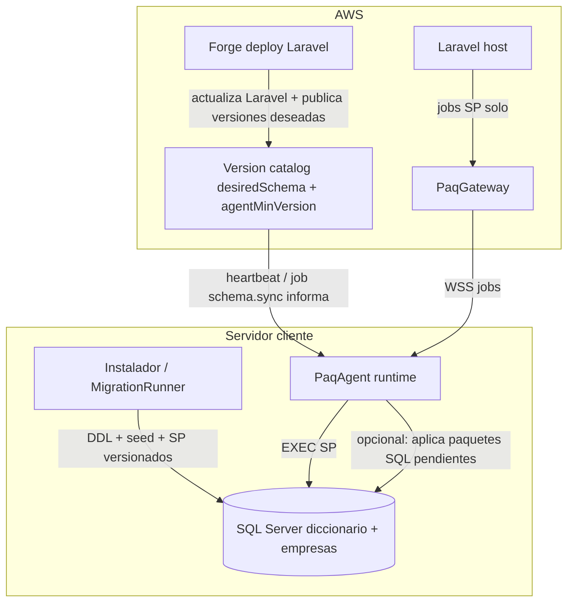

# Plan: ciclo SQL, updates de app y update del agente

| Campo | Valor |
|-------|--------|
| Fecha | 2026-09-03 |
| Estado | Análisis vigente — **no altera** SPEC-AGW-001 ni decisiones D1–D17 del MVP de conectividad |
| Alcance | Fase 2 / SPEC-AGW-002 (borrador de dirección) |
| Referencias | GEN-18 Framework (`SPEC-001-18`), SPEC-AGW-001 en esta carpeta |

> Este documento conserva el análisis previo al scaffold. El MVP de conectividad (`01-SPEC-producto.md`, `02-decisiones-tecnicas.md`, HU/TR) **sigue intacto**.

---

## Veredicto corto

**No conviene aplicarlo de entrada en el MVP de conectividad.** Conviene **diseñarlo ahora** (SPEC fase 2) y dejar **ganchos mínimos** en el caño, sin implementar el bootstrap PQ completo ni auto-update del binario todavía.

Motivo: son tres productos distintos mezclados en una sola intuición. Meterlos juntos revive el desvío anterior (mucho SQL / muchas features sobre un caño incompleto).



---

## Tres problemas, tres dueños

| Problema | Qué es | Quién debe ejecutarlo | Cuándo |
|----------|--------|------------------------|--------|
| **A. Bootstrap / update SQL PQ** | Tablas, seeds (users/roles/menús/params), SP en diccionario y cada empresa | **En el cliente**: instalador y/o `SqlMigrationRunner` del agente | Install agente; update de app/módulo; alta empresa |
| **B. Deploy app Laravel** | Código PHP, migraciones AWS (`tenants_catalog`), OpenAPI, etc. | **Forge** | Cada release de Tango/producto |
| **C. Nueva versión del agente** | Binario Windows Service + instalador | Canal de release (GitHub hoy; auto-update después) | Independiente del deploy Forge |

### Regla crítica (modo gateway)

Con `agent_id` + `client_id`, Laravel **no tiene** connection string SQL al cliente. Por tanto:

- **Forge no puede** hacer `migrate` / seed / `CREATE PROCEDURE` sobre el SQL del tenant en modo agente.
- El diseño GEN-18 del Framework asume install/update en el **host** cuando hay SQL directo; en gateway solo documenta “runtime = AgentesClientes, solo SP”.
- Hoy el agente viejo ya aplica SP `PAQ_*` embebidos (`SqlMigrationRunner`). Las tablas PQ “de producto” vía Laravel migrate **rompen** en gateway puro.

**Conclusión:** en modo agente, el paquete SQL (DDL+seed+SP) viaja **hacia el cliente** (embebido en el agente/instalador o descargado firmado) y se aplica **allí**. Forge solo publica la **versión deseada** y el código Laravel.

En tenants **legacy** (sin agente) puede seguir el loop Forge/Laravel multi-BD hasta la transformación total (coherente con D5 ya cerrada en el MVP).

---

## Respuestas a los tres frentes

### 1) ¿Instalación SQL en el mismo instalador del agente u otro?

**Recomendación:** mismo .exe, **dos fases** en el wizard (no un segundo producto):

1. **Fase conectividad** (MVP actual): identidad + SQL creds + prueba gateway + servicio. Deja el caño verde.
2. **Fase esquema PQ** (fase 2): “Inicializar / actualizar objetos PQ” — diccionario, empresa(s), users, roles, menús, params, SP. Reutiliza la misma conexión SQL local.

Separar en otro instalador solo aporta fricción de soporte. Separar en **otra fase de SPEC** sí: no bloquea el MVP.

Sobre **PQ_EMPRESA / lista de empresas en el instalador:**

- Default GEN-18: una empresa inicial (= `nombre` de `EMPRESAS_CONEXION` / primera habilitada).
- Si el diccionario ya tiene varias empresas Tango: el instalador puede listar `{diccionario}.empresa` / `pq_empresa` y pedir selección de las que se habilitan/seedan **en esa pasada**; el resto queda para ABM + `seedEmpresaNueva` (vía job al agente en modo gateway).

### 2) ¿Quién detecta updates SQL: Forge o el agente?

**Ambos, con roles distintos:**

| Rol | Forge / Laravel | Agente |
|-----|-----------------|--------|
| Detectar “hay release nuevo de app/módulo” | Sí (deploy) | No hace falta que mire Git |
| Saber qué schema/módulos requiere esa versión | Publica `desiredSchemaVersion` + matriz módulos (catálogo AWS o endpoint interno) | Lee desired vs applied |
| Ejecutar DDL/seed/SP en SQL del cliente | **No** en modo agente | **Sí** (runner) |
| Abortar si una empresa falla | N/A en gateway | Sí (política: diccionario fail-fast; empresas secuencial como GEN-18) |
| Alta empresa nueva | ABM en Laravel dispara | Job `schema.seedEmpresa` / reusa `seedEmpresaNueva` en el cliente |

Flujo update de app:

```text
Forge deploy Laravel
  → actualiza desiredSchemaVersion / módulos contratados en catálogo
  → agentes online reciben (heartbeat respuesta o job schema.sync)
  → MigrationRunner aplica pendientes
  → schema_ready / operational; si falla → degraded
```

Referencia Framework a alinear (no copiar ciego): GEN-18 install vs update, `seedEmpresaNueva`, params solo caption/tooltip en update, matriz módulos. Extender el gap explícito: **paquete SQL remota vía agente**.

### 3) Nueva versión del agente

Canal **aparte** del schema SQL:

- MVP: release GitHub + SHA256 (D9 del MVP); update = bajar instalador / reemplazo de servicio (manual).
- Fase 2: auto-update (servicio mira release, checksum, stop/start).
- Heartbeat puede reportar `agentVersion`; Laravel puede marcar “agente desactualizado” sin forzar update en el MVP.

El update del agente **puede** traer nuevos scripts SQL embebidos; al arrancar, el runner aplica.

---

## Mapa de objetos SQL → dónde viven

| Objeto | Diccionario | Cada empresa | Quién aplica (modo agente) |
|--------|-------------|--------------|----------------------------|
| Tablas PQ seguridad/menús/params grales | Sí | — | Runner install/update |
| `PQ_EMPRESA` + seed inicial | Sí | — | Install (+ selección UI) |
| Users PQ + ADMIN, rol supervisor, permisos | Sí | — | Install (fail-if-exists); update **no** re-seed users (GEN-18) |
| Menús, `pq_parametros`, excel/pivot… | Sí (catálogo) | Según módulo | Install/update por matriz |
| Tablas PQ operativas | — | Sí | Install empresa / `seedEmpresaNueva` |
| `PQ_PARAMETROS_GRAL` por empresa | — | Sí | Idem; update solo meta |
| SP `PAQ_*` / `pq_sp_*` | Sí | Sí | Runner |

ABM alta empresa = **mismo paquete “empresa nueva”** que el install inicial, disparado por Laravel → job al agente (gateway) o migrate local (legacy).

---

## Qué hacer ahora vs después

### No meter en el MVP de conectividad (SPEC-AGW-001 intacto)

- Bootstrap completo PQ (users, menús, N empresas, excel/pivot…).
- Loop update multi-BD orquestado.
- Auto-update del agente.
- Que Forge intente migrar SQL remoto en modo agente.

### Sí dejar en el MVP (extension points baratos)

Al implementar HU-004…006 / TR-005…007:

- Heartbeat / diagnostics: `agentVersion`, `schemaVersionApplied` (o lista checksums), readiness `schema_ready`.
- Un SP piloto `PAQ_Auth_Login` embebido (ya previsto en el MVP) — **mínimo** para verdear login, no el GEN-18 entero.
- Este documento = dirección de **SPEC-AGW-002**; el runner de bootstrap no es camino de jobs de negocio.

### Fase 2 — SPEC-AGW-002 (a redactar formalmente tras caño verde)

1. Formato del paquete SQL (dictionary/company, checksums, orden).
2. Install wizard fase 2 (selección empresas, users iniciales).
3. Update: desired version desde Laravel + apply en agente.
4. `seedEmpresaNueva` vía job.
5. Política permisos SQL install vs runtime.
6. Agent binary update (manual → auto).
7. Compatibilidad: `agentVersion` ↔ `appVersion` ↔ `schemaVersion`.

---

## Riesgo si se ignora este análisis

Repetir el agente actual: runner de SP al startup + Laravel migrate inalcanzable en gateway + instalador sin bootstrap de seguridad ⇒ `schema_ready` eterno o login roto según el cliente.
