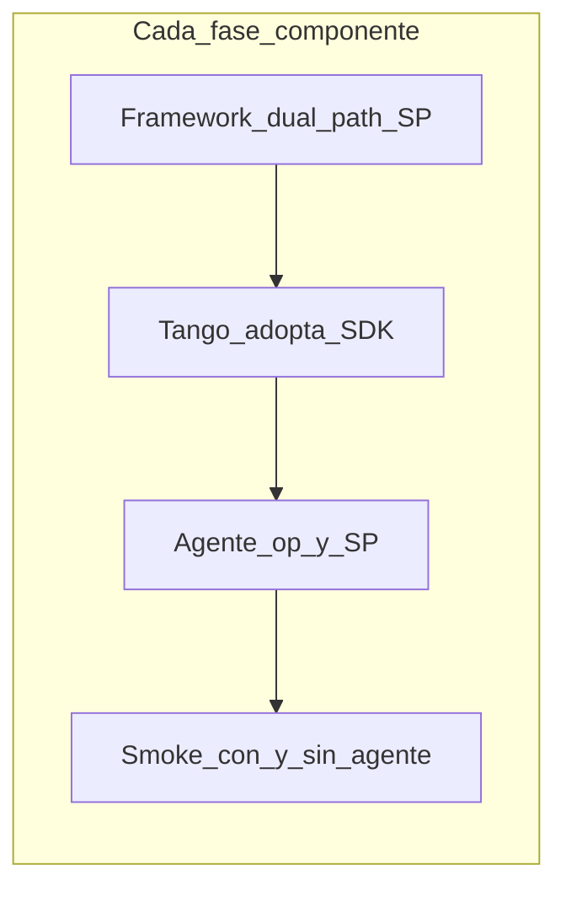

# Plan 100% — integración Framework + Agente + Tango

| Campo | Valor |
|-------|--------|
| Fecha | 2026-09-08 |
| Repos | `PaqSuite-IA-FRAMEWORK` · `PaqSuite-IA-AgenteCliente-PAQ` · `PaqSuite-IA-TANGO` |
| Alcance | Producto Tango **completo** en modo agente + path sin agente (MUST SP / GEN-18) |
| Estado de partida | Login agente OK (`auth.login` + `agw.`); canal `laravel-core` 1.3.7; dual-path parcial en Tango; agente solo `diagnostics.run` + `auth.login`; shell bloqueado por `ValidateCompanyId` → 403 |

> **Hoja de ruta activa (2026-09-12):** [plan-20260912-desarrollo-hibrido-plataforma-dominio.md](./plan-20260912-desarrollo-hibrido-plataforma-dominio.md) + inventario [f0-20260912-inventario-dual-path.md](./f0-20260912-inventario-dual-path.md). Este documento queda como contexto histórico; F1–F3 ya cerrados.

```text
Framework (plataforma + canal)  →  Host Tango (dominio + adopción SDK)  →  Agente (SQL whitelist)
laravel-core                       jobs + UI + sin duplicar SDK            handlers + SP
```

---

## Objetivo de “100%”

Un cliente **productivo en modo agente** usa Tango completo **sin SQL desde AWS**: cada dato del SQL del cliente pasa por **operación de lista blanca → stored procedure parametrizado**. El mismo SP (o contrato equivalente) se usa en path **sin agente** (MUST SP / override Framework `02-base-datos` / GEN-18).

Tango **adopta** `paqsuite/laravel-core` para tenancy, company, sesión, menú, grillas, pivots, etc. No reimplementa esos componentes en el host. No hay parches provisorios solo-Tango para bugs de plataforma.



### Patrón fijo por fase (nunca invertir)

1. **Framework:** dual-path del componente + tests del package.
2. **Smokes package** con/sin agente (lab con path-repo; **Satis** al cerrar corte deployable).
3. **Tango:** cablear al SDK; retirar duplicado local.
4. **Agente:** ops + scripts SP **solo si** el componente toca SQL del cliente.
5. **Regresión:** tenant sin `agent_id` + lab `lenovo`.

### Reglas no negociables

- Sin SQL libre vía agente.
- Sin fallback por `host` en modo agente (`AGENT_OFFLINE` claro).
- Sin inventar requisitos fuera de SPEC.
- MUST SP en **ambos** modos (compatibilidad).
- Lab: path-repo symlink a `PaqSuite-IA-FRAMEWORK/packages/php/laravel-core`. Satis = Forge/CI/corte publicable. Verdaccio = npm/front (no `laravel-core`).

---

## Roles

| Repo | Dueño de | No dueño de |
|------|----------|-------------|
| **FRAMEWORK** | Canal HTTP, tenancy, company, sesión SDK, menú/seguridad, params/pivots/notifs/grids del package, contratos SP Framework | Ops Tango (GVA, informes), instalador .exe |
| **TANGO** | Dominio, UI, alta `empresas_conexion`, adopción SDK, jobs de producto | Binario PaqAgent, lista blanca C# |
| **AgenteCliente** | Whitelist, runners, SQL cliente, instalador, PaqGateway | Lógica Laravel / menús de producto |

---

## Fase 0 — Baseline y matrices

**Objetivo:** no integrar a ciegas.

| # | Trabajo | Done when |
|---|---------|-----------|
| 0.1 | Inventario Framework (`packages/php/laravel-core/src/`): Agents, Tenancy, Auth, Security, Menu, Parametros, Pivots, Notifications, Audit, Tasks, GruposEmpresarios, Mail, Emissions, Arca, SmartCapture, ChatAssistant, ExcelImport, I18n, Http middlewares | Matriz en docs Framework o anexo control |
| 0.2 | Gap Tango: middlewares propios (`ValidateCompanyId`, `ResolveDictionaryConnection`, `ResolveTenant`, `SetCompanyConnection`, `AuthenticateBearerSession`, …) vs `paqsuite.*` / `EnsureCompanyAllowed*` / `ApplyInstalacion*` | Gap list adoptable |
| 0.3 | Inventario ops: `sendJob` / `GATEWAY_OPERATION_*` en Tango vs `JobOperations` en Agente (hoy: `diagnostics.run`, `auth.login`) | Tabla Tango ↔ Agente |
| 0.4 | Commit/push Tango de lo ya ganado (login `agw.`, dual-path, wrappers) **cuando autoricen** | Deploy Forge no pisa el lab |
| 0.5 | Política path-repo (lab) vs Satis (corte deployable) documentada | Equipo alineado |

---

## Fases plataforma (Framework primero → Tango → Agente si SQL)

Orden por **dependencia**. Las grillas **no** son la primera fase.

### F1 — Canal + Tenancy

| Repo | Trabajo |
|------|---------|
| FRAMEWORK | Consolidar `AgentGatewayClient`, `AgentGatewayMode`, `GatewaySessionToken`, `InstalacionRecord` / `ResolveInstalacionMiddleware`, `ApplyInstalacionDatabaseMiddleware` (no PDO si gateway). Override `07-agente-gateway-canal.md`. |
| TANGO | Unificar `shouldUseGateway` → `AgentGatewayMode`; alinear `ResolveTenant` / dictionary con tenancy FW; quitar path-repo al publicar Satis del corte. |
| Agente | Sin ops nuevas. |

**Done when:** tenant con/sin agente resuelve modo sin ambigüedad; offline → `AGENT_OFFLINE`.

### F2 — Sesión Bearer + Company (desbloquea shell)

| Repo | Trabajo |
|------|---------|
| FRAMEWORK | `CompanyAllowedChecker` dual-path (sesión `agw.` / empresas del login vs SQL / `pq_sp_user_empresa_allowed`); `EnsureCompanyAllowedMiddleware` listo para host; contrato de snapshot de sesión (user + empresas). |
| TANGO | Adoptar middleware FW; **retirar** `ValidateCompanyId` SQL; persistir empresas en sesión (`SanctumSessionCache` o equivalente FW); `SetCompanyConnection` no abre SQL en modo agente. |
| Agente | Sin op nueva si empresas ya vienen de `auth.login`. Incluir `auth.session` **solo** si el diseño de sesión FW exige rehidratación sin re-login; si no, re-login ante cache miss hasta cerrar F2. |

**Evidencia lab (2026-09-08):** post-login + empresa → `POST /api/v1/perf/warmup` (y menu/dashboard/turnos) → 403 `Empresa no autorizada para este usuario` por `ValidateCompanyId` + dictionary no reapuntado.

**Done when:** warmup/menu/dashboard no 403 por empresa en `lenovo` con bearer `agw.` + `X-Company-Id` válida del login.

### F3 — Auth / Seguridad admin / Menú

| Repo | Trabajo |
|------|---------|
| FRAMEWORK | `Menu`, `Security` (`UserEmpresas*`, `AccesoTotal*`, repos admin), `EnsureProcedimientoAutorizadoMiddleware` — dual-path vía SP + op o datos de sesión. |
| TANGO | `UserMenuController`, `MenuProcedureAuthorization`, admin permisos → SDK. |
| Agente | Ops tipo `menu.efectivo`, `user.empresas`, admin según inventario; SP `pq_sp_user_*` / `PAQ_*`. |

**Done when:** shell con menú real en modo agente; sin agente sigue SP local.

### F4 — Parámetros / preferencias / warmup de plataforma

| Repo | Trabajo |
|------|---------|
| FRAMEWORK | `Parametros`, `UserPreferencesRepository`, contratos que use warmup del host si son SDK. |
| TANGO | Warmup/preferencias cableados; sin SQL host en modo agente. |
| Agente | Ops + SP de params/prefs. |

**Done when:** post-login estable sin PDO dictionary en modo agente.

### F5 — Grillas / layouts

| Repo | Trabajo |
|------|---------|
| FRAMEWORK | Dual-path persistencia layouts (MUST SP). |
| TANGO | Todas las grillas adoptan el componente FW (no reimplementar). |
| Agente | Ops layouts + SP. |

**Done when:** grilla piloto E2E + checklist de pantallas Tango migradas.

### F6 — Pivots

| Repo | Trabajo |
|------|---------|
| FRAMEWORK | `Pivots` / catálogo / layouts — MUST SP + dual-path. |
| TANGO | Adopción. |
| Agente | Ops pivots + SP. |

### F7 — Notificaciones + Audit (+ Mail si toca SQL tenant)

| Repo | Trabajo |
|------|---------|
| FRAMEWORK | `Notifications` / `NotificationService` / `Audit` (+ Mail si persiste en tenant). |
| TANGO | Adopción. |
| Agente | Ops + SP según tablas tenant. |

### F8 — Tasks / Grupos empresarios

| Repo | Trabajo |
|------|---------|
| FRAMEWORK | `Tasks`, `GruposEmpresarios`. |
| TANGO | Emfaco/grupos + tareas programadas dual-path. |
| Agente | Ops + SP. |

### F9 — Capas satélite (solo si tocan SQL del cliente)

Evaluar y fasear: `SmartCapture`, `ChatAssistant`, `ExcelImport`, `Emissions`, `Arca`.

- **Arca / engines remotos:** si no leen dictionary/company → documentar “sin SQL agente”; si persisten en SQL tenant → misma regla SP + op.
- **I18n:** sin SQL → solo adopción Tango; no fase Agente.

---

## Fases dominio Tango (después de F1–F2; en paralelo desde F3)

Cada oleada:

```text
Contrato JSON
  → dual-path host (Gateway si agent_id; SP local si no)
  → JobOperations + handler + tests (Agente)
  → script SQL dictionary/company (Agente)
  → rebuild PaqAgent (+ instalador si redistribuyen)
  → aplicar SP en lab / cliente
  → E2E lenovo + regresión sin agente (mismo SP)
```

No ampliar whitelist “de a montones” sin contrato. Una op (o familia) por TR en Agente.

| Oleada | Ops (Tango ya pide muchas; Agente aún no) |
|--------|--------------------------------------------|
| **D1** | `tango.version`, `clientes.buscar` / `clientes.obtener`, `articulos.buscar` / `articulos.obtener`, `pedidos.pendientes`, `stock.consultar`, `saldos.consultar`, `comprobantes.recientes` |
| **D2** | Informes gestión (`informes.*`) |
| **D3** | Acopios + parámetros acopios |
| **D4** | Robinet (tableros) |
| **D5** | Partes producción + informes partes |
| **D6** | Pedidos venta / órdenes de compra / resto SQL-only aún sin `sendJob` (cierre inventario Fase 0) |

---

## Operación y cierre

| # | Trabajo |
|---|---------|
| O.1 | Runbook: alta `empresas-conexion:alta-agente`, install agente, WSS, login, company, menú, una op D1 |
| O.2 | CD separados: Framework (Satis) · Tango (Forge/Vercel) · Agente (binario/instalador) |
| O.3 | Segundo host PaqSuite: solo consume `laravel-core`; ops propias en Agente |

**Fuera de este plan (SPEC-AGW-002):** auto-update .exe, bootstrap masivo de tablas/seeds/SP PQ en todos los SQL.

---

## Criterios de cierre

### Intermedios

| Corte | Criterio |
|-------|----------|
| Tras **F2** | Shell usable en lab agente (sin 403 de empresa) |
| Tras **F3 + D1** | Piloto productivo acotado: menú + maestros básicos |
| Por oleada D/F | Satis + deploy + smoke con/sin agente |

### 100% productivo

- [ ] Todos los componentes Framework que Tango consume: dual-path + Tango sin duplicado
- [ ] Todas las ops de dominio del inventario Fase 0: en Agente + SP desplegado en cliente
- [ ] Tenant **sin** agente: mismo producto vía SP local
- [ ] Lab `lenovo` E2E shell + módulos del producto
- [ ] Docs de los tres repos alineadas (sin contradicción fallback vs corte duro)

---

## Decisiones fijadas

| Tema | Decisión |
|------|----------|
| Orden de fases | Por componente Framework (F1…F9); grillas = **F5** |
| Lab vs Satis | Path-repo en lab; Satis al cerrar cada corte deployable |
| Productivo | Este plan = 100% producto Tango en modo agente; un cliente solo se instala en agente cuando el alcance comercial esté agent-ready |
| SP | MUST en ambos modos; ideal mismo contrato |
| `auth.session` | En F2 solo si el diseño de sesión FW lo requiere; si no, re-login ante cache miss |
| Parches Tango | No provisorios para bugs de plataforma; TR en Framework → bump → adopción |

---

## Relacionado

- [adaptar-un-host-al-agente.md](../00-contexto/adaptar-un-host-al-agente.md)
- [MANUAL-DEL-PROGRAMADOR.md](../00-contexto/MANUAL-DEL-PROGRAMADOR.md)
- [SPEC-AGW-001](../02-producto/SPEC-AGW-001-producto.md)
- Arranque SDD **este repo:** [sdd-arranque-integracion-agente-plan-100.md](./sdd-arranque-integracion-agente-plan-100.md)
- Arranque SDD **Framework:** `PaqSuite-IA-FRAMEWORK/docs/08-control/sdd-arranque-integracion-agente-plan-100.md`
- Arranque SDD **Tango:** `PaqSuite-IA-TANGO/docs/08-control/sdd-arranque-integracion-agente-plan-100.md`
- Framework: `docs/10-overrides-framework/07-agente-gateway-canal.md`, `02-base-datos-sqlserver-mysql.md`
- TANGO: `docs/06-operacion/modo-agente-gateway.md`
