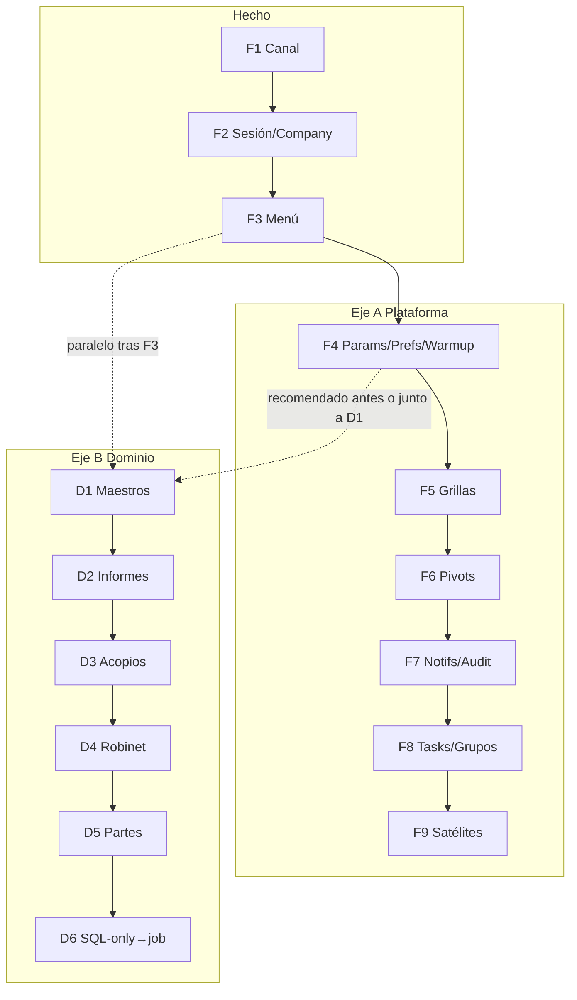

# Plan 2026-09-12 — Desarrollo híbrido (plataforma Fx + dominio Dx)

| Campo | Valor |
|-------|--------|
| Fecha | 2026-09-12 |
| Repos | FRAMEWORK · TANGO · AgenteCliente |
| Sustituye como hoja de ruta activa | [plan-20260908…](./plan-20260908-integracion-tango-framework-agente.md) (sigue válido como contexto; **este** manda el orden de trabajo) |
| Inventario | [f0-20260912-inventario-dual-path.md](./f0-20260912-inventario-dual-path.md) |
| Estado baseline | F1–F3 **cerrados** (F1+F+Finalizado GEN-33; menú lab OK) |
| Pendiente | **Aceptación humana** de este plan antes de abrir D1 de F4 o D1 dominio |

No sustituye SPEC-AGW-001 ni GEN-18 / override MUST SP.

---

## 1. Respuesta directa: ¿por fase o de qué manera?

**Por componente en el eje plataforma (F4, F5, …)** — cada fase = un tema del SDK (`Parametros`, grillas, pivots, …), con el patrón fijo:

```text
Framework (dual-path + tests)
  → Tango adopta (retira duplicado / PDO)
  → Agente (op + SP) solo si ese componente toca SQL del cliente
  → Smoke lenovo + regresión sin agent_id
```

**Y en paralelo (no en vez de)** el eje dominio (D1, D2, …): Tango **ya** tiene `sendJob` para muchas pantallas; el cuello de botella es la **whitelist del Agente**. Ahí se ataca **por oleada de ops**, una familia por TR.



### Qué no hacemos

- No “cerrar todo Framework primero” sin D1: el producto se ve roto en pantallas que ya llaman Gateway.
- No “cerrar un módulo Tango vertical” saltando F4: warmup/prefs siguen pegando SQL al host.
- No ampliar la whitelist del Agente de a 20 ops sin contrato/SP.

---

## 2. Eje A — Plataforma (por fase / componente)

| Fase | Tema | FW | Tango | Agente | Done when |
|------|------|----|-------|--------|-----------|
| ~~F1~~ | Canal + tenancy | ✓ | ✓ | — | Modo inequívoco; offline 9002 |
| ~~F2~~ | Sesión + company | ✓ | ✓ | auth.login | Company sin ValidateCompanyId SQL |
| ~~F3~~ | Menú + procedimiento | ✓ | ✓ | menu.authorized | Shell con menú real |
| **F4** | Params / prefs / warmup | Dual-path + contratos | Quitar PDO warmup/prefs/params | Ops mínimas si hace falta | Post-login estable sin PDO dictionary/company de plataforma |
| **F5** | Grillas / layouts | Dual-path layouts MUST SP | `PqGridLayout` → SDK | `grid.layouts.*` | Piloto E2E + checklist pantallas |
| **F6** | Pivots | Dual-path | Adopción | `pivots.*` | E2E pivots dual-path |
| **F7** | Notifs + Audit (+ Mail tenant) | Dual-path si SQL tenant | Adopción | Según tablas | Dual-path |
| **F8** | Tasks + GruposEmpresarios | Dual-path | Emfaco/tareas | Ops + SP | Dual-path |
| **F9** | Satélites | Evaluar Arca/Emissions/Excel/… | Según uso | Solo si SQL tenant | Doc “sin SQL” o SPEC+TR |

**Orden:** no empezar por F5. F4 es el siguiente Must de plataforma.

---

## 3. Eje B — Dominio (por oleada de ops)

Patrón por oleada (igual que plan 2026-09-08):

```text
Contrato JSON → dual-path host (ya en muchos) → JobOperations + handler + tests
  → script SP → deploy lab → E2E lenovo + regresión sin agente
```

| Oleada | Contenido | Nota |
|--------|-----------|------|
| **D1** | `tango.version`, clientes, artículos, pedidos pendientes, stock, saldos, comprobantes recientes | Host ya `sendJob`; Agente vacío |
| **D2** | `informes.*` | Muchas ops; agrupar por TR |
| **D3** | `Acopios.*` | Incluye params acopios |
| **D4** | `robinet.*` | |
| **D5** | Partes params/informes (+ CRUD si ya hay job) | |
| **D6** | Módulos aún SQL-only → introducir sendJob + SP | Inventario continuo |

---

## 4. Secuencia recomendada (para tu análisis)

| Paso | Qué | Por qué |
|------|-----|---------|
| **0** | Aceptar este plan (o ajustar prioridad D1 vs F4) | Gobernanza |
| **1** | **F4** SDD en Framework (SPEC-update / HU / TR) | Quita PDO del shell |
| **2** | Adopción F4 Tango + ops Agente si el SPEC lo exige | Lab post-login limpio |
| **3** | **D1** (1–2 ops piloto, luego resto D1) | Valor negocio sin esperar F9 |
| **4** | F5 ↔ D2 según pantallas que rompan por layouts | Intercalar |
| **5** | F6–F9 y D3–D6 | Según dependencia y demanda |

**Pregunta abierta para vos:** ¿preferís **F4 completo antes de cualquier D1**, o **F4 mínimo (solo warmup anti-PDO) + D1 piloto en paralelo**?

---

## 5. Roles (sin cambio)

| Repo | Dueño de |
|------|----------|
| FRAMEWORK | Dual-path SDK, contratos SP de plataforma, tests package |
| TANGO | Adopción SDK, dominio, UI, `empresas_conexion` |
| AgenteCliente | Whitelist, runners, SP cliente, Gateway, instalador |

---

## 6. Criterios de avance

- No abrir F5 si F4 no tiene F1/F apto (o acuerdo explícito de “F4 mínimo”).
- No abrir D2 masivo si D1 no tiene al menos un piloto verde en lab.
- Cada Fx y cada Dx: circuito A→…→F1→F en el repo dueño; Finalizado solo humano.
- Lab: path-repo Framework; no commit de secretos / `appsettings` locales.

---

## 7. Fuera de alcance (sigue SPEC-AGW-002)

Auto-update del .exe; bootstrap masivo DDL/seeds en todos los SQL cliente.

---

## 8. Historial

| Fecha | Cambio |
|-------|--------|
| 2026-09-08 | Plan 100% inicial (F0–F9 + D1–D6) |
| 2026-09-12 | F0 inventariado; F1–F3 cerrados; plan híbrido activo; F4 + D1 como próximos |
